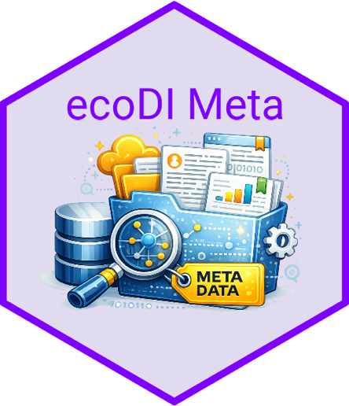
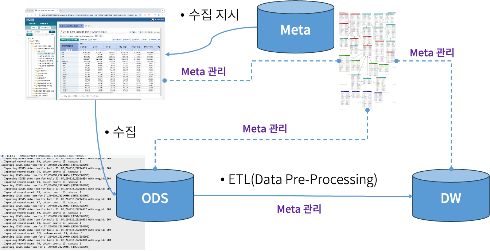

<!-- README.md is generated from README.Rmd. Please edit that file -->

# ecoDI Meta

## 개요

ecoDI Meta는 ecoDI family를 운용하기 위한 메타 데이터 관련 리소스입니다.

## 내용

ecoDI Meta는 다음을 포함합니다.

### 논리적 데이터 모델

데이터 생성, 관리, 저장, 분석 및 공유를 지원하는 데 필요한 데이터 구조
및 관계 정의

- 테이블 정의서
  - 메타 데이터의테이블을 정의한 정보
- ERD -메타 데이터의 ER 모델을 정의한 다이어 그램 - eXERD 도구 사용

### 물리적 데이터 모델

데이터 생성, 관리, 저장, 분석 및 공유를 지원하는 데 필요한 물리적
데이터베이스 구조 정의

- DDL 스크립트
  - 메타 데이터의 물리적 데이터베이스 구조를 정의한 SQL 스크립트
    - MySQL DBMS 대상
- 메타데이터에 초기 적재할 데이터
  - 메타 데이터의 물리적 데이터베이스에 적재할 초기 데이터 파일
    - CSV 파일 형식
- 메타 데이터에 마이그레이션할 데이터
  - 기존 데이터 소스에서 메타 데이터로 마이그레이션할 데이터 파일
    - MySQL 덤프 파일 형식

## 메타 데이터 적용 대상

메타 시스템에 대상이되는 DBMS 스키마는 다음과 같음:

메타 시스템 대상 DBMS 스키마

